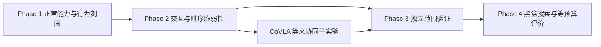

# VLA-LIBERO

**视觉语言动作模型的黑盒跨模态鲁棒性与攻击研究**

本项目在 LIBERO 操作仿真中研究视觉与语言如何共同影响 VLA 的目标选择和闭环执行，并探索这些行为规律能否提高有限查询预算下的黑盒攻击效率。研究方案按 CoVLA 的结构组织：正常能力与语义约束、配对反事实、交互度量、候选搜索、独立验证及失效边界。

更新日期：2026-10-09（Asia/Shanghai）。研究设计、当前实测与条件性后续安排分别注明；协同现象尚未得到本项目实验证实。

[完整研究方案](plans/研究方案.md) · [专题文档](plans/README.md) · [当前进度](docs/RESUME.md) · [Phase 1 执行协议](docs/PHASE1_ENTRY.md) · [环境与运行](docs/RUNNING.md)

## 研究问题与定位

语言给出对象、关系和操作目标，视觉提供当前布局。局部视觉变化或语言表述变化可能影响选物与动作，但任务失败也可能来自正常能力不足、执行困难或任务语义改变。

核心问题是：**能否通过可见行为识别条件性跨模态脆弱性，并将其转化为可复现、查询有效的黑盒方法？**

| 研究要素 | 项目设定 |
| --- | --- |
| 被测系统 | 固定权重 VLA，保留原生相机、本体输入、预处理和动作接口 |
| 黑盒反馈 | 动作或动作块、任务成功失败；搜索不使用梯度、概率、embedding 或注意力 |
| Phase 1 | 先核查正常能力，再研究事实冲突下的条件化目标选择 |
| Phase 2 | 同状态四分支、组合放大／抑制、干扰进入撤除及恢复 |
| CoVLA 子问题 | 等义改写＋可见补丁，在弱单模态约束下检验正交互 |
| 后续贡献 | 独立范围证据、等预算搜索收益、冻结候选迁移及负面发现 |

事实冲突与等义协同分别评价。N/A/X/U 比较辅助事实内容；CoVLA 四分支比较视觉和语言变化的交互，二者不能合并为同一种实验。

## 四分支与协同定义

在同一任务和保存状态下，固定目标、评价事件及输入变化规则，恢复模拟器、策略缓存、动作队列与随机状态：

| 分支 | 视觉 | 语言 |
| --- | --- | --- |
| 00 | 原始观察 | 原始有效指令 |
| 10 | 视觉变化 | 原始有效指令 |
| 01 | 原始观察 | 语言变化 |
| 11 | 与 10 相同的变化规则 | 与 01 相同的语言变化 |

```text
视觉主效应 ΔV = p10 - p00
语言主效应 ΔT = p01 - p00
联合净效应 ΔVT = p11 - p00
概率加性尺度交互 Γ = p11 - p10 - p01 + p00
```

p 表示预定义失败事件的概率。联合失败更多不能单独证明协同；还需报告原始四项、主效应、区间与独立复现。CoVLA 子实验进一步要求任务等义、补丁合法及弱单模态合规，完整判据见[Phase 2](plans/黑盒跨模态攻击/04_行为刻画与脆弱性发现.md)。

## 方法与阶段路线



| 阶段 | 主要输出 | 继续条件 |
| --- | --- | --- |
| Phase 1 行为刻画 | 正常基线、语义及事件清单、双向事实冲突图谱 | 指代与正确事实可用，输入和真值有效 |
| Phase 2 脆弱性发现 | 四分支交互、等义协同、阶段及恢复边界 | 现象可复测，排除目标变化及明显主效应解释 |
| Phase 3 范围验证 | 留出初始化、模板、任务及合格模型结果 | 冻结构造后独立确认，失效与负结果同列 |
| Phase 4 方法设计 | 动作筛选＋任务反馈校正、预算曲线与迁移 | 等预算方法收益，独立最终评价；协同搜索以协同证据为前提 |

一般黑盒方法可依据条件依赖或时序风险成立，协同是待验证子问题。白盒机制分析为可选解释，不提供搜索反馈。

## 当前实证进度

最新 N/A 核查来自 2026-10-08，2026-10-09 另有两条独立中性追加诊断。**当前主模型为 SmolVLA；Phase 1 停在正常能力核查，正确辅助事实 A 未通过。**

| 已完成工作 | 结果与解释 | 记录 |
| --- | --- | --- |
| 三模型环境与推理检查 | CUDA、双相机、动作预测及 30 步真实观测闭环通过 | [配置状态](docs/SETUP_STATUS.md) |
| Spatial 每任务 1 个 episode 基线 | SmolVLA 8/10、Adapter 10/10、PulseVLA 9/10；不同栈结果不作统一排名 | [基线报告](docs/SPATIAL_BASELINE_20261006.md) |
| SmolVLA 原双碗 init0..2 的 N/A | 两方向 N 均 2/3，A 均 0/3；真值、画面与等长预检通过，A 行为未通过 | [最新 N/A 核查](docs/PHASE1_SMOLVLA_SPATIAL_NA_20261008.md) |
| SmolVLA init0 独立中性追加 | 两方向均 neither，新增 2 条／60 次查询；不能单独隔离长度、换行或参照物提及因素 | [诊断报告](docs/PHASE1_SMOLVLA_SPATIAL_NEUTRAL_20261009.md) |
| VLA-Adapter 候选诊断 | 14 条完整 rollout、536 次查询；双碗第二方向未通过，单碗及措辞结果有各自边界 | [历史汇总](docs/PHASE1_EXPERIMENT_SUMMARY_20261008.md) |

N/A 共 12 条结果、360 次 rollout 查询及 2 次旧诊断；该轮新增 10 条、300 次查询，两条旧 init0 N 只复用一次。中性追加的 2 条独立 U 探针另计，未加入正式矩阵。正式 X/U 冲突矩阵、80 条扩样、CoVLA 四分支及攻击搜索仍未启动。当前先重新设计并冻结辅助事实载体，再核查 A；四个 Q×N/A 块各至少 2/3 正确独占完成才进入条件性 X/U。该门槛仅用于探索推进。

原版指代、固定初始化及停止规则见[执行入口](docs/PHASE1_ENTRY.md)，成本见[路线与查询账本](plans/黑盒跨模态攻击/07_实施路线与查询预算.md)。已测模板、失败和中止均属于已见探索，不充作独立测试。更早 SmolVLA 与 Adapter 结果保留在[接续记录](docs/RESUME.md)及对应历史报告中。

## 模型与运行基础

| 模型 | 当前角色 | 权重／配置 |
| --- | --- | --- |
| SmolVLA | 主模型、首先用于能力核查与后续发现 | `HuggingFaceVLA/smolvla_libero`，原生 hf-libero／MuJoCo 3.3.2 栈 |
| VLA-Adapter 原版 | 历史对照与验证候选 | Spatial／Goal 已配置，`use_pro_version=False`，原版 LIBERO 栈 |
| PulseVLA-LIBERO 0.5B | 验证候选 | `verapulse/pulsevla-libero-0.5b`，发布者指定栈 |

每个模型使用独立 Python 环境，保留自己的图像处理、动作转换和执行块长度。验证模型通过自身正常能力核查后加入；原始 SR 或动作 L2 不直接用于跨模型排名。版本以 [sources.json](configs/sources.json)、`requirements/*.lock` 和每轮 manifest 为准。

本机通过 WSL2／Ubuntu 22.04 运行，从项目根目录的 PowerShell 调用：

```powershell
powershell -ExecutionPolicy Bypass -File .\scripts\vla.ps1 doctor all --policy
powershell -ExecutionPolicy Bypass -File .\scripts\vla.ps1 eval smolvla --suite libero_spatial --episodes 1
```

这些命令用于环境检查与基线评测，研究矩阵按独立冻结的执行协议运行。完整安装、固定依赖、下载、渲染和评测说明见[环境与运行](docs/RUNNING.md)。本机 RTX 3070 8GB 默认逐模型、单环境运行；权重、缓存、完整视频及运行输出不提交 Git。

## 文档与目录

| 入口 | 用途 |
| --- | --- |
| [完整研究方案](plans/研究方案.md) | CoVLA 形式的背景、问题、权限、形式化、方法、实验、风险与里程碑 |
| [专题索引](plans/README.md) | 文献、设定、模型、行为、搜索、评估和预算细节 |
| [当前进度与接续](docs/RESUME.md) | 当前决定、证据、产物位置与下一步 |
| [Phase 1 执行协议](docs/PHASE1_ENTRY.md) | 冻结场景、指令、条件、门槛及复用规则 |
| [历史实验汇总](docs/PHASE1_EXPERIMENT_SUMMARY_20261008.md) | 对应日期的逐轮结果、成本与结论边界 |
| [环境与运行](docs/RUNNING.md) | 安装、版本、下载、检查和基线评测 |

`configs/` 保存源版本与实验配置，`scripts/` 保存启动和核查脚本，`requirements/` 保存依赖锁，`papers/` 保存已有文献，`outputs/` 与 `logs/` 保存本地产物。历史报告按原统计范围保留，研究方案不将假设或计划写成实验结论。
