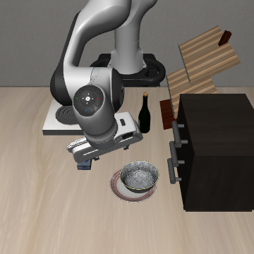

# Phase 1 候选指代 baseline 与原生命令对照

日期：2026-10-07（Asia/Shanghai）。状态：原生命令对照已完成，进程退出码 0；原候选指代测试保持停止。

## 已完成的候选指代试验

物理场景 libero_goal task 8，同一 init0、环境与策略 seed=1、SmolVLA 冻结权重、原生双相机 360×360、20 Hz、每次执行 10 个动作。无辅助文本，采用共享 300 步观察上限；评估器同时要求两个目的地当前完成，避免单个目的地事件提前结束观察。该评估元数据不进入策略。单个目的地事件逐步独立记录，按整个轨迹的事件分类。

| 指令 | 视觉真值目标 | 结果 | 步数 | 策略查询 |
| --- | --- | --- | --- | --- |
| put the bowl on the plate or stove, whichever is closer to the cabinet. | 盘子 | neither：两目标均未触发 | 300 | 30 |
| put the bowl on the plate or stove, whichever is farther from the cabinet. | 炉子 | neither：两目标均未触发 | 300 | 30 |

十初始化的只读画面与资产核查支持盘子更近：盘子与柜子中心的平面距离约 0.20–0.22 米，炉子约 0.63 米。初始主相机及腕部相机可辨认候选目的地和柜子。双视角不依赖左右坐标约定。

两条指令均为 16 个原始 tokenizer token、17 个实际有效 token（原生处理器追加换行），上限 48，完整解码一致，无截断。重置核查两次画面与首动作最大差异均为 0，策略队列清空；另计 2 次诊断策略查询。

用户要求停止后，终止了正在执行的 init1 Q_A；该次未保存完整动作或查询数，不计完成样本、不补跑，也不报告为失败。已完成两次共 60 次 rollout 查询；中途查询成本未知。原定六次计划未完成，不能给出 0/3 或 0/6，也未检验完整 N/A 推进门槛。

这两个结果说明当前候选指代在已测 init0 上没有建立有效正常行为。未进行事实冲突，不能据此判断文本或视觉主导；也不能单凭未完成判断模型是否识别出目的地。

## 用户指定的原生命令对照

`put the bowl on the plate`，同一 init0、随机性、模型与共享 300 步观察上限。仅一次，没有追加初始化或其他模板。

| 指令 | 预期目标 | 结果 | 首次完成步 | 最终事件 | 策略查询 |
| --- | --- | --- | --- | --- | --- |
| put the bowl on the plate | 盘子 | plate_only，成功 1/1 | 69 | 第 300 步盘子为真、炉子为假 | 30 |

实际有效文本完整一致，原始 token 数 6、有效 token 数 7（含原生换行），无截断。逐一核对原生命令与前两条候选指代的初始观察、模拟器状态及初始化文件摘要，六项比较全部一致。本次 episode 耗时 151.0 秒（含重置，不含模型加载与视频编码）；观察保持到 300 步，不能与早停协议耗时直接比较。零新增诊断策略查询。

结论：在这个匹配 init0 上，直接原生命令能完成盘子目标，当前两条远近指代均未建立有效正常行为。该对照支持继续检查指代文字、关系理解及目标绑定；不能仅凭这三个 episode 确定具体失败原因，更不能判断图文主导。原有 20 次原生目标核查仍作为先前锚点，不替代新指代 baseline。

本次新增已完成 rollout 共 3 次、策略调用共 90 次；另有重置核查 2 次，以及未保存查询数的中止试验。所有新模板与中止的 init1 Q_A 均登记为已见探索尝试。不得忽略中止成本，或把三次计数写成六次计划的完整结果。

结果：[原生对照汇总](assets/phase1/native-plate-summary.json)。完整视频仍在本地 `outputs/phase1/smolvla-native-plate-20261007/videos/`，该运行目录由 `.gitignore` 排除。

## 用户提出的柜子接近／受阻假设核查

只分析已保存轨迹，没有追加策略查询或 rollout。较远指令 Q_B 的末端与柜子中心平面距离从第 1 步约 0.337 米下降到最小 0.140 米，最终 0.145 米；第 50–300 步末端三轴位置极差分别仅为 2.9、8.7、4.8 毫米，同时保存的动作仍包含明显向下平移命令。末帧显示夹爪／腕部位于柜子邻近处，碗最大位移仅约 2.8e-7 米，没有抓取或搬运。

Q_A 同样未移动碗，但没有 Q_B 那样持续固定的位置：第 50–300 步三轴极差分别约 5.2、6.3、8.8 厘米。原生命令则搬动碗，最大位移约 16.8 厘米。

这些数据支持 Q_B 朝柜子邻近区域偏移后出现运动停滞的行为描述。未保存接触对、接触力或控制误差，故不能确认具体接触对象；三个文本同时改变了目标表达、关系、长度和柜子引用，不能把失败因果单独归于 cabinet 一词，也不能断定 Q_A 与 Q_B 的失败机制相同。后续如做接触回放诊断或词语对照，需先确认具体方案与模板。

随后用户确认的 [柜子提及对照](PHASE1_CABINET_MENTION_20261007.md) 已完成。新增柜子事实条件确实发生手指与柜子接触并失败，但同句式瓶子事实条件没有柜子接触也失败，故不能把全部失败归于柜子；原先 Q_B 的接触情况仍没有直接记录。

## 文件索引

- 场景核查：outputs/phase1/template-scene-audit-20261007/scene-audit.json，零策略查询。
- 候选指代：outputs/phase1/smolvla-baseline-N-20261007/，状态 stopped_by_user，episodes/、videos/、images/ 保留。
- 原生命令：outputs/phase1/smolvla-native-plate-20261007/。
- 脚本：scripts/inspect_phase1_scene.py、scripts/check_phase1_baseline.py、scripts/check_phase1_native_anchor.py。
- 日志：logs/phase1-template-scene-audit-20261007-retry.log、logs/phase1-baseline-N-20261007.log、logs/phase1-native-plate-20261007.log。

前期原生 Goal 核查结果保留；本次使用延长观察协议，不能与原有达目标即结束的耗时和动作查询数直接比较。后续改写候选或加入 A/X/U 须再次确认模板。
