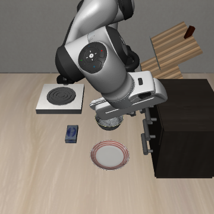
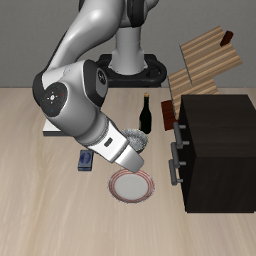

# 柜子提及对照

日期：2026-10-07（Asia/Shanghai）。状态：两次试验已完成，进程退出码 0；没有启动其他条件。

用户提出柜子一词可能使机械臂靠向柜子并受阻，确认先保留直接盘子命令、追加无关柜子事实的小试验。本轮采用同句式瓶子事实作为一般文本添加控制，两个条件各 init0 一次，没有关系指代或事实冲突。

| 条件 | 完整输入 | 运行口径 |
| --- | --- | --- |
| 原生对照 | `put the bowl on the plate` | 复用已保存的匹配 init0 成功结果，不新增调用 |
| 柜子事实 | `put the bowl on the plate. The cabinet is on the table.` | 新增一次 |
| 中性瓶子事实 | `put the bowl on the plate. The bottle is on the table.` | 新增一次 |

两条辅助句均为实际场景的正确事实，不改变目的地；柜子和酒瓶在资产中均置于桌上。辅助文本语法、位置、标点相同，只替换对象词。先用实际 tokenizer 核查等有效 token 数与不截断，未通过不自动改词。

模型、预处理、物理 task8、init0、环境与策略 seed=1、硬重置、360×360 双相机、20 Hz、10 动作块、共享 300 步观察上限均沿用原生对照。每个 rollout 首次策略调用前核对初始画面、模拟状态和初始化摘要与原生对照一致。判据仍为独立 plate/stove 事件，整段分类 plate_only/stove_only/both/neither，不追加其他初始化或模板。

额外保存每个控制动作前和最终状态的外部机器人接触对，区分木柜与其他物体；这是模拟器诊断元数据，不输入策略，也不增加策略查询。每十步保存部分记录，若中止，完成查询数与尚在进行的查询分别标注。没有保存接触力，接触出现也不等于它造成失败。

## 结果

| 条件 | 完成结果 | 首次盘子事件 | 机械臂／夹爪与柜子接触 | 碗最大位移 |
| --- | --- | --- | --- | --- |
| 原生对照（复用） | plate_only，成功 | 第 69 步 | 原生运行未保存接触记录 | 约 16.8 cm |
| 柜子事实 | neither，失败 | 未触发 | 第 32 步首次接触，301 个采样状态中 118 个存在接触 | 约 0.00028 mm（数值级微动） |
| 瓶子事实 | neither，失败 | 未触发 | 301 个采样状态中 0 个存在接触 | 约 3.3 mm |

两个新增条件均为 14 个原始 token、15 个有效 token（含原生换行），没有截断。两条件与复用原生对照的初始观察、模拟状态和初始化摘要全部一致；每次均执行到 300 步，无盘子或炉子完成事件。新增 60 次策略调用，零诊断策略调用；原生对照的 30 次只复用、不新增。

柜子条件的接触对是 `wooden_cabinet_1_g9`／`wooden_cabinet_1_g18` 与 `gripper0_finger1_collision`。末端与柜子中心的平面距离最小约 10.0 cm。存在夹爪与柜子实际接触和抓取／搬运失败，符合柜子邻近区域受阻的候选解释；没有保存接触力，不能量化它对失败的贡献，也不能断定它是唯一失败机制。

瓶子条件没有柜子接触，末端到柜子中心最近约 22.6 cm；保存的其他外部接触对为桌面与夹爪手指。碗有约 3.3 mm 的微小位移，仍未搬到任一目的地。该控制也失败，因此柜子接触不能解释全部附加文本条件的失败。

本轮支持两个有限结论：柜子描述条件确实出现朝柜子邻近区域偏移和接触；仅用 cabinet 一词解释全部任务失败不充分。当前辅助事实输入本身尚未建立正常能力，不能直接进入图文冲突或宣布模态主导。原生命令与附加句输入还同时改变了长度、基础句末句号和辅助语义，未单独隔离这些因素；单初始化、小样本不作普遍结论。此前远近指令没有保存接触记录，这次结果不能替代原轨迹的接触诊断。

| 柜子事实末帧 | 瓶子事实末帧 |
| --- | --- |
|  |  |

结果：[汇总](assets/phase1/cabinet-mention-summary.json)，[柜子接触记录](assets/phase1/contacts/cabinet-fact.json)，[瓶子接触记录](assets/phase1/contacts/bottle-fact.json)。

数据：outputs/phase1/smolvla-cabinet-mention-20261007/；日志：logs/phase1-cabinet-mention-20261007.log；脚本：scripts/check_phase1_cabinet_mention.py。此前六次指代计划保持停止，完整 A/X/U 草案仍待确认。
