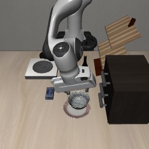
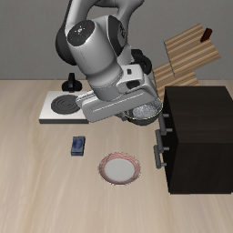

# Phase 1 换模型复查：VLA-Adapter

日期：2026-10-07（Asia/Shanghai）。状态：六次 init0 对照全部完成，进程退出码 0；完成时间 23:20。VLA-Adapter 两条原生命令和两条事实追加成功，两条远近指代均未完成任一目的地。

用户怀疑此前失败可能与模型能力有关，授权换模型试验。按现有研究计划选择 VLA-Adapter，保持已经试过的六条英文文本，先检查原生盘子／炉子命令，均通过后再检查远近指代和柜子／瓶子事实追加。最多六次 init0 rollout，另计两次重置诊断，不扩大初始化，不进入事实冲突条件。

## 配置与比较边界

| 项目 | SmolVLA 已有试验 | VLA-Adapter 本轮 |
| --- | --- | --- |
| 物理场景 | libero_goal task 8 | libero_goal task 8 |
| 初始化／种子 | init0、环境与策略 seed=1 | init0、环境与策略 seed=1 |
| 观察上限与事件口径 | 300 策略步；盘子／炉子独立记录 | 同口径；原生 10 步静置另计 |
| 仿真 | hf-libero、MuJoCo 3.3.2 | 原版 LIBERO、MuJoCo 2.3.7 |
| 原生双相机大小 | 360×360 | 256×256 |
| 每次执行动作数 | 10 | 8 |
| 权重 | HuggingFaceVLA/smolvla_libero | VLA-Adapter/LIBERO-Goal |

Goal 权重固定提交 `d1aa0654ccac22cb7e45a55f21692433e9ae7e63`，代码版本按 [sources.json](../configs/sources.json)；使用原版 `use_pro_version=False`、`use_minivlm=True`、双相机、本体状态、上游动作转换和预处理。不同模型的仿真与原生处理不同，差异不能单独归因于模型能力。

运行前已用 AST 核对远近指代、柜子事实及瓶子事实与冻结脚本原文完全相同。新 tokenizer 下六条文本长度依次为 6、6、16、16、14、14 token；这些是不含上游对话包装的文本长度。运行脚本另外检查实际双相机 processor 输入、完整解码和无截断。

## 运行与产物

[运行脚本](../scripts/check_phase1_adapter.py)。完整产物保存在本地 `outputs/phase1/vla-adapter-model-switch-20261007/`，日志 `logs/phase1-adapter-model-switch-20261007.log`。两个路径由 `.gitignore` 排除；已保存可提交的 [结果汇总](assets/phase1/adapter-model-switch-summary.json)、[运行配置](assets/phase1/adapter-model-switch-manifest.json)、[重置核查](assets/phase1/adapter-model-switch-reset-audit.json)和 [实际输入核查](assets/phase1/adapter-model-switch-input-audit.json)。

每次重置清空动作队列、重设环境和策略种子，核对 VLA-Adapter 内的观察、模拟器状态与初始化摘要；先重复同一原生命令首动作块并检查重现。共用只用于评估的盘子 AND 炉子目标，独立记录整个轨迹中两类目的地事件，分类为 `plate_only`、`stove_only`、`both`、`neither`。单一目的地完成不会提前结束观察。

此轮为一个初始化的探索筛查，不建立一般成功率，也不判断图文主导。SmolVLA 的已停止试验仍保持停止，所有原有结果保留。

## 实际结果

所有条件均观察满 300 个策略步，额外静置 10 步不计策略步。每次 rollout 查询 38 次，六次共 228 次；重置诊断另 2 次，共新增 230 次策略查询。没有中止或未保存的本轮查询，也没有运行 A/X/U。

| 条件／完整指令 | 预期目标 | VLA-Adapter 分类 | 首次完成步 | 既有 SmolVLA 对照 |
| --- | --- | --- | --- | --- |
| `put the bowl on the plate` | 盘子 | plate_only，成功 | 75 | 成功，首次 69 步 |
| `put the bowl on the stove` | 炉子 | stove_only，成功 | 87 | 既有 Goal 核查成功；观察早停协议不同 |
| `put the bowl on the plate or stove, whichever is closer to the cabinet.` | 盘子 | neither，失败 | 无 | neither，失败 |
| `put the bowl on the plate or stove, whichever is farther from the cabinet.` | 炉子 | neither，失败 | 无 | neither，失败 |
| `put the bowl on the plate. The cabinet is on the table.` | 盘子 | plate_only，成功 | 88 | neither，失败 |
| `put the bowl on the plate. The bottle is on the table.` | 盘子 | plate_only，成功 | 80 | neither，失败 |

各成功条件第 300 步仍满足正确目的地，未触发另一目的地；两个关系指代全过程没有触发任一目的地。先前 SmolVLA 数据来源见 [baseline 对照](PHASE1_BASELINE_20261007.md)、[柜子提及](PHASE1_CABINET_MENTION_20261007.md)和 [Goal 核查](SMOLVLA_GOAL_CHECK_20261007.md)。

VLA-Adapter 六次初始观察、模拟器状态、初始化摘要全部相同；每次重置后动作队列为空。两次首动作块完全一致（最大差异 0）。盘子／炉子距柜子中心的平面距离约 0.224／0.631 米，远近关系有效；只用于诊断，不送入策略。

实际上游对话包装后原生命令 43 token、远近指代 52 token、两条事实追加 50 token。每个 rollout 的 38 次查询都分别核对两路相机 processor，共 76 份实际输入；解码与完整上游 prompt 一致，没有截断。上游会将指令转小写，包装行为保留且在输入资产中可复核。模型加载按此前 Spatial 配置保留自动备份／同步配置及模型代码的兼容流程，未修改权重张量。

结论：在已测 init0 上，VLA-Adapter 能容忍这两条附加事实，SmolVLA 在对应条件下失败；附加文本失败存在模型／运行栈依赖。两模型的远近关系模板都未通过，因此不能把 Phase 1 受阻单独归因于 SmolVLA，也没有建立可用的关系指代 baseline。VLA-Adapter 可以作为后续候选模型，但应先确认更简单的自然指代模板并重新检查 N/A 能力，当前仍不具备进入事实冲突矩阵的依据。

## 用户追加：简化关系指令

六次复查后，用户要求试简化指令，授权这次模板修改。保留同一模型、场景、init0、随机种子、目的地事件和 300 步上限，去掉原句中的 `, whichever is`：

- Q_A：`put the bowl on the plate or stove closer to the cabinet.`
- Q_B：`put the bowl on the plate or stove farther from the cabinet.`

两条各一次，无辅助事实；直接复用上一轮成功的原生锚点，要求初始观察、模拟器状态、初始化摘要匹配。零新增诊断查询，不重复原生命令，不扩初始化、不进入冲突。[新增脚本](../scripts/check_phase1_adapter_simple.py) 导入原运行器，校验其 SHA-256 与原 manifest 一致，避免修改旧试验的运行逻辑。输出 `outputs/phase1/vla-adapter-simple-N-20261007/`，日志 `logs/phase1-adapter-simple-N-20261007.log`。

23:30 全部完成，进程退出码 0。短版 Q_A/Q_B 均为 `neither`，各 300 步，全程未触发盘子或炉子目的地；每条 38 次策略调用，追加共 76 次，零新增诊断调用。初始观察、模拟器状态、初始化摘要均与成功的原生锚点相同；实际对话包装后两条都是 49 token，较原版 52 token 少 3 个，无截断。每条的 76 份双相机 processor 输入均通过核对。[短版汇总](assets/phase1/adapter-simple-summary.json)、[配置](assets/phase1/adapter-simple-manifest.json)、[输入核查](assets/phase1/adapter-simple-input-audit.json)。

| 短版条件 | 预期目的地 | 结果 | 步数 | 策略查询 |
| --- | --- | --- | --- | --- |
| Q_A closer to the cabinet | 盘子 | neither，失败 | 300 | 38 |
| Q_B farther from the cabinet | 炉子 | neither，失败 | 300 | 38 |

本次两轮累计 8 个完整 rollout，304 次 rollout 查询及 2 次诊断查询，共 306 次。缩短本轮句法后仍未建立有效关系指代，不能把原版失败仅归于 `whichever is` 或文本长度，也不能根据这两个短版样本判断模型普遍不理解距离。当前仍不进入事实冲突，后续需要另选可验证的自然指代候选。
