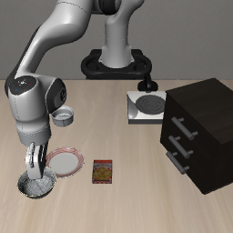
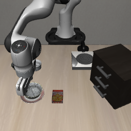

# Phase 1：ramekin 名称与直观描述对照

日期：2026-10-08（Asia/Shanghai）。状态：两次措辞配对全部完成，13:48 正常退出（退出码 0）。原版 neither，描述版完成了错误碗1；均未完成目标碗2。

假设：原双碗场景中无法选择 ramekin 旁碗2，可能与参照物名称或指代形式有关。先前单碗成功只证明改造场景中的操作可行；只有一个候选黑碗时，成功不证明模型正确识别了 ramekin。

## 冻结条件

VLA-Adapter Spatial 原版权重、原版 LIBERO、物理 task 8、init0、环境与策略 seed=1、双相机原生处理、每次执行 8 个动作、20 Hz、10 步静置、300 策略步共同上限。保留原场景的两个黑碗，不移动物体、不改物理参数，也不加入单碗诊断中的额外 forward／观测刷新。沿用已冻结的原双碗运行器和两碗独立放置判据。

| 条件 | 完整指令 | 预期对象 |
| --- | --- | --- |
| ramekin_side | `pick up the black bowl next to the ramekin and place it on the plate` | 碗2 |
| descriptive_side | `pick up the black bowl next to the small white bowl and place it on the plate` | 碗2 |

仅将参照物名称 `ramekin` 替换为 `small white bowl`；从原场景策略主相机核查，ramekin 为与目标碗2相邻的小型浅色瓷碗，与两个黑碗和盘子可区分。该替换加入颜色与大小信息，因此测的是措辞／描述信息效应，不是对单个词知识的独立测量。

完整原始指令已核查均为 17 token。原双碗实际包装为 54 token；此次实际两路 processor 输入均要求达到相同长度并完整解码，否则停止并记接口异常。每条各执行一次，零额外诊断策略调用，不扩初始化、不加入辅助事实或冲突。

## 配对与复核

- 两条原始重置须匹配旧双碗 ramekin episode 的初始观察、模拟器状态与初始化 SHA-256。
- 新两条件内部再核对同一初始状态，动作队列重新建立、随机性重新设定。
- 原 ramekin 条件完整重跑，检查与旧保存轨迹的动作最大差异、放置分类和事件时间；该比较读取已有动作，不新增查询。
- 保存原生及预处理后的双相机图像、两碗抓取接触代理、抬升、位移、放置事件和动作轨迹。短暂指垫接触不单独认定稳定抓持。

## 运行与产物

[运行脚本](../scripts/check_phase1_ramekin_wording.py) 导入冻结的 Spatial 运行器并核对文件 SHA-256，不修改旧脚本。输出 `outputs/phase1/vla-adapter-ramekin-wording-20261008/`，日志 `logs/phase1-adapter-ramekin-wording-20261008.log`。完整视频和轨迹保留本地，结构化结果、配置、核查与截图已另存归档。

已保存 [结果](assets/phase1/ramekin-wording-summary-20261008.json)、[配置](assets/phase1/ramekin-wording-manifest-20261008.json)、[原轨迹重放核查](assets/phase1/ramekin-wording-replay-audit-20261008.json)、[文本预检](assets/phase1/ramekin-wording-text-preflight-20261008.json)及 [实际输入核查](assets/phase1/ramekin-wording-input-audit-20261008.json)。

## 实际结果

| init0 指令措辞 | 预期对象 | 300 步轨迹分类 | 抓取接触与放置 |
| --- | --- | --- | --- |
| ramekin | 碗2 | neither，失败 | 碗2无双侧指垫接触；碗1第 127 步短暂接触，未完成放置 |
| small white bowl | 碗2 | bowl1_only，错误对象完成 | 碗1第 49 步双侧指垫接触，第 92 步首次放到盘子；碗2无接触 |

描述版中错误碗1最大抬升约 11.2 厘米、位移约 15.0 厘米，第 300 步仍在盘子上；目标碗2最大位移约 2.8×10⁻⁷ 米。原版复现碗1被推动约 14.5 厘米、抬升不足 1 厘米，两个碗均未完成放置。接触状态用于抓取代理，错误对象的完整放置由独立目标谓词确认。

两次各 300 策略步、38 次查询，新增 76 次 rollout 查询、零诊断调用；没有异常、中止或扩样。加本轮后主模型前置核查累计 14 次完整 rollout、532 次 rollout 查询及 4 次策略诊断，总计 536 次；此前单碗零查询预检错误和刷新诊断仍单独保留。

两条件内部、以及与旧双碗初始记录的观察／模拟器状态／初始化摘要均一致。原 `ramekin` 这次完整 300 步的执行动作与旧轨迹最大差异为 0，事件时间及分类一致。没有移碗或额外 forward 刷新，本轮词汇比较不包含单碗干预的物理／刷新变化。

完整原始文本均为 17 token；实际上游包装后的两条均为 54 token，无截断，各核对 76 份双相机 processor 输入。长度相同不意味着语义信息量相同，描述版包含颜色和大小线索。

结论：在这个配对 init0 上，更直观的描述改变了动作和终局行为，但仍未选中正确碗2，因此本次替换没有解决目标绑定问题。不能由单个失败对照排除词汇理解假设，也不能断言模型理解或不理解 ramekin；还需区分参照物识别、关系绑定、场景偏好及其他因素。本轮仍不进入事实冲突矩阵。

运行前预定解释规则：若描述版成功而原版失败，支持名称／描述形式影响该场景的目标选择，仍保留颜色／大小信息与单初始化限制。若两条都未完成正确目标，表示该替换未解决当前问题，不能排除词汇问题或认定模型理解了 ramekin。本轮不计算文本／视觉主导或攻击成功率。
