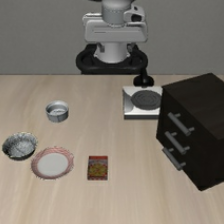
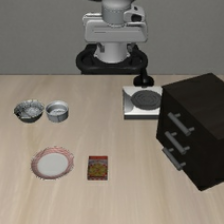
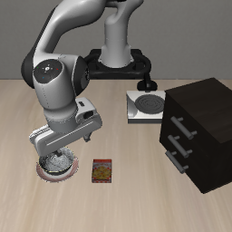
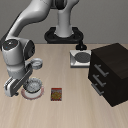

# Phase 1：Spatial 单碗能力对照

日期：2026-10-08（Asia/Shanghai）。状态：两次单碗对照全部成功，13:19 正常退出（退出码 0）。首次零查询预检错误已单独保留；修正后完成两次正式 rollout，不扩样。

目的：此前 task 8 双碗场景中，VLA-Adapter 能完成盘子旁碗1，却未操作 ramekin 旁目标碗2。本轮减少同类对象竞争，检查目标碗在改造后的场景中能否完成抓取和放置；该对照同时改变视觉与物理障碍，不单独识别指代或模态效应。

## 固定设置

沿用 VLA-Adapter Spatial 固定权重、原版 LIBERO、task 8、init0、环境与策略 seed=1、原生双相机 256×256 和预处理、每次执行 8 个动作、20 Hz、重置后静置 10 步、300 策略步共同观察上限。两条英文指令与 [已有双碗核查](PHASE1_SPATIAL_REFERENCE_20261008.md) 完全相同。

| 条件 | 目标与指令 | 场景干预 |
| --- | --- | --- |
| plate_side | 碗1；`pick up the black bowl next to the plate and place it on the plate` | 将碗2移出工作区 |
| ramekin_side | 碗2；`pick up the black bowl next to the ramekin and place it on the plate` | 将碗1移出工作区 |

仅执行以上两条各一次，不补初始化，不加入事实或冲突。每条先进行零策略查询的模拟状态预检，再重新重置执行 rollout；复用已通过的原运行器及重置核查，不重复原双碗 rollout。

## 干预与核查

在与已保存双碗试验完全匹配的重置及静置之后，将非目标碗的自由关节平移到世界坐标 `[5, 5, 0.9]` 米；保留其方向，速度清零、碰撞掩码清零、重力补偿设为 1，使其停留在远离工作区的位置。只修改这一碗的状态及相应模型参数，每次硬重置恢复原场景后再施加本条件干预。没有删改原场景文件、权重或原试验。

核查并保存：

- 干预前的初始观察、模拟器状态和初始化 SHA-256 与相应原双碗 episode 相同。
- 干预前加入一次仅 forward／观测刷新的零查询控制，确认 qpos／qvel 不变；与原缓存的派生位置及观测差异另记。干预后的其他 qpos、qvel、物体位置和机器人本体观察与该刷新控制比较并要求不变；完整画面和状态摘要因移碗改变，分别记录。
- 以相机外参、视角和保守包围半径 0.25 米检查远处碗不在两路视锥内，另存实际原生及策略图像复核。
- 每条改造场景的 rollout 初始摘要与该条件的零查询预检一致。
- 每个控制步检查远处碗偏离停放位置不超过 10⁻⁵ 米，且不出现抓取接触或放置事件。
- 原有目标事件、接触代理、抬升、位移、动作和实际双相机 prompt 核查全部保留；两条件共用评估器 AND，单目标完成不提前结束观察。

## 运行与产物

[脚本](../scripts/check_phase1_single_bowl.py) 继承冻结的 Spatial 运行器，先核对其摘要与原运行 manifest。修正后输出 `outputs/phase1/vla-adapter-single-bowl-20261008-retry1/`，日志 `logs/phase1-adapter-single-bowl-20261008-retry1.log`；完整视频和轨迹保留本地。首次零查询预检的错误、配置、脚本快照及诊断保存在原不带 retry1 的目录，不覆盖。

首次预检将新 forward 后的派生位置与原缓存直接比较，触发了保护。单独的零查询诊断显示，刷新本身使物体派生位置最大变化约 1.4×10⁻⁸ 米、本体缓存部分分量变化约 2.0×10⁻⁴，但 qpos、qvel 的变化都为 0。修正采用同一物理状态的刷新控制，再检查移碗是否影响其他状态，没有放宽 10⁻¹⁰ 的状态保护容差。该次不计作 episode 或模型失败，零新增策略查询。

已保存 [结果与双碗比较](assets/phase1/single-bowl-summary-20261008.json)、[配置](assets/phase1/single-bowl-manifest-20261008.json)、[干预预检](assets/phase1/single-bowl-preflight-20261008.json)、[实际输入与干预核查](assets/phase1/single-bowl-input-audit-20261008.json)及 [仅刷新诊断](assets/phase1/single-bowl-forward-refresh-20261008.json)。

## 实际结果

| init0 条件 | 既有双碗结果 | 本次单碗结果 | 首次双侧指垫接触 | 首次放置 |
| --- | --- | --- | --- | --- |
| plate_side，操作碗1 | bowl1_only，成功，第 99 步放置 | bowl1_only，成功 | 第 59 步，37 个接触采样状态 | 第 93 步 |
| ramekin_side，操作碗2 | neither，目标碗2无双侧指垫接触 | bowl2_only，成功 | 第 59 步，44 个接触采样状态 | 第 99 步 |

两次各观察 300 策略步，第 300 步仍只有目标碗满足放置。碗1最大抬升约 9.7 厘米、位移约 16.4 厘米；碗2最大抬升约 13.4 厘米、位移约 26.8 厘米。两次被移走碗的位置误差、抬升、位移均为 0，没有任务接触或放置事件。

每条 38 次策略查询，新增共 76 次；预检、刷新诊断和首次错误都为零策略查询，零新增诊断调用。此前主模型 10 次候选核查共 384 次查询，加本轮后累计 12 次完整 rollout、456 次 rollout 查询及 4 次策略诊断，共 460 次。没有自动增加初始化或运行辅助事实、冲突。

干预前两条均匹配对应旧双碗试验的三类摘要；正式改造场景重置均匹配各自预检。与仅刷新控制相比，其他 qpos、qvel、物体位置及全部本体观测的差异均为 0。两路相机保守视锥核查通过；策略主相机截图可辨认剩余碗与参照物，移走的碗不在画面中。

实际上游包装后原指令分别为 52／54 token，与旧双碗记录一致，无截断；两条各检查 76 份双相机 processor 输入。原日志中的 `source_xy_distances_m` 由继承运行器保留，表示移碗前的源位置距离；移碗后的实际位置与干预参数另存于 `initial_objects_xyz`、`intervention`，不能把原距离当作远处碗的新距离。

仅刷新控制还记录到与原缓存画面的最大像素差为主相机 25、腕部相机 50（8-bit 像素单位），以及上述本体缓存差异。单碗 rollout 使用刷新后的真实观测，因此与已保存双碗轨迹的比较还包含这一观测更新差异；本轮未追加“刷新后的双碗”rollout，不能独立排除该因素。

结论：两只碗在各自改造后的单碗场景中均能完成操作，原失败位置存在可用的操作条件。原双碗场景的目标碗2失败尚不能单独归因于指代理解、视觉竞争或碰撞；对比还包含观测缓存刷新因素。单碗只有一个候选对象，这两次成功也不证明双碗自然指代有效，仍未达到进入事实冲突矩阵的门槛。

若目标碗2在单碗场景成功，只说明改造后场景可完成该操作；与双碗结果的差异同时可能涉及视觉竞争、碰撞变化和场景分布，不能直接断言原失败只因指代理解。若单碗仍失败，应继续定位操作能力、视野和接近轨迹，也不能仅凭一个初始化认定物理不可达。
