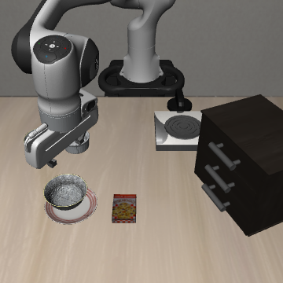
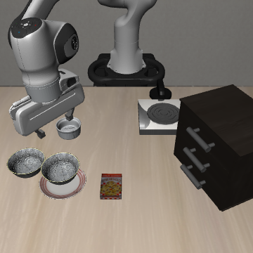

# SmolVLA Spatial 原版指代复查

2026-10-08，14:39 完成，退出码 0。按用户要求换回 SmolVLA，保留原版 ramekin 指代，在原双碗场景各跑一次，不移碗、不替换名称。

**结果：同一个 init0 中，两条指令都选对碗并完成放置。**

| 原版指令 | 预期目标 | SmolVLA 结果 | 首次完成步 | 之前 VLA-Adapter 结果 |
| --- | --- | --- | ---: | --- |
| `pick up the black bowl next to the plate and place it on the plate` | 盘子旁碗1 | bowl1_only，成功 | 91 | 碗1成功，第99步 |
| `pick up the black bowl next to the ramekin and place it on the plate` | ramekin旁碗2 | bowl2_only，成功 | 150 | neither，失败 |

两条使用 Spatial task 8 的同一场景、init0、环境／策略 seed=1，各执行300个策略步。第300步仍只有预期碗满足放置，没有把错误碗放上盘子。ramekin 条件第104步首次双侧指垫接触碗2，最大抬升约13.3厘米；碗1没有抓取接触，最大位移约7.2毫米。

SmolVLA 沿用固定权重 `HuggingFaceVLA/smolvla_libero`（提交 `6721902bc4d61e50a3bfdb11dfb4cb626f05d102`）、hf-libero／MuJoCo 3.3.2、原生360×360双相机和本体状态、20 Hz、10步动作块、10步静置。独立记录碗1／碗2放置事件，评估器用两目标AND防止单目标提前结束。完整配置见下方manifest。

重置核查通过：重复起始观测和首动作最大差异均为0，策略队列清空。两条起始观测、模拟器状态和初始化摘要完全一致；场景文件及初始化状态摘要也与旧 VLA-Adapter 记录相同。实际有效文本分别16／18 token，包含原生追加换行，无截断；每条核查30次策略输入的两路相机。

**成本：60次 rollout 查询 + 2次重置诊断 = 62次。** 没有扩初始化，没有运行辅助事实或图文冲突，也没有恢复旧 SmolVLA Goal 试验。

这说明原版 ramekin 指代在本轮 SmolVLA 场景上可用，当前候选通过单初始化的双向小试。它不证明一般词汇理解或多初始化稳定性。跨模型的相机、模拟器、预处理和动作块不同，不能把差异完全归因于模型本身；后续仍需正常能力与正确事实核查。

| 盘子旁碗1完成 | ramekin旁碗2完成 |
| --- | --- |
|  |  |

依据：[结果](assets/phase1/smolvla-spatial-summary-20261008.json)、[配置](assets/phase1/smolvla-spatial-manifest-20261008.json)、[重置核查](assets/phase1/smolvla-spatial-reset-audit-20261008.json)、[实际输入与配对核查](assets/phase1/smolvla-spatial-input-audit-20261008.json)、[脚本](../scripts/check_phase1_smolvla_spatial.py)。

完整视频／轨迹在本地 `outputs/phase1/smolvla-spatial-reference-20261008/`，日志 `logs/phase1-smolvla-spatial-reference-20261008.log`；以上路径被Git忽略，精简证据另存于docs/assets。先前的[实验总报告](PHASE1_EXPERIMENT_SUMMARY_20261008.md)及PDF保留原统计范围，本轮作为后续新增试验。
