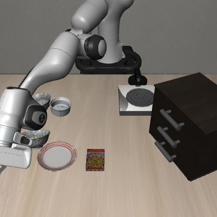
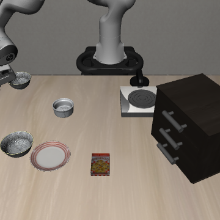

# SmolVLA Spatial：三初始化 N/A 核查

2026-10-08，16:06完成，退出码0。原双碗Spatial task 8、SmolVLA、原版plate／ramekin指代不变。

**核查执行完毕，但推进门槛未通过：两个方向N均2/3成功，A均0/3；暂不进入X/U冲突实验。**

| 指令方向 | N无辅助 | A正确事实 | 门槛 |
| --- | ---: | ---: | --- |
| 盘子旁碗1 | 2/3 | 0/3 | A不通过 |
| ramekin旁碗2 | 2/3 | 0/3 | A不通过 |

## 每个初始化的结果

| 初始化 | 盘子方向N | 盘子方向A | ramekin方向N | ramekin方向A |
| --- | --- | --- | --- | --- |
| init0 | 成功，第91步（复用） | neither，失败 | 成功，第150步（复用） | neither，失败 |
| init1 | 成功，第103步 | neither，失败 | neither，失败 | neither，失败 |
| init2 | neither，失败 | neither，失败 | 成功，第253步 | neither，失败 |

所有12条结果均观察300策略步。成功均为正确碗独占完成；失败均为neither，两只碗都未触发上盘子事件，没有把错误碗完成计作成功。

## 本轮通过了哪些检查

- 三初始化的初始参照关系唯一，距离对比保持至少0.05米；主相机可见两只黑碗、盘子和ramekin，腕部相机视野有限且保持原生配置。
- 起始观测、模拟器状态和初始化摘要在同一init的N/A之间一致；init0也匹配旧小试，复用原两条N及原重置诊断，没有新增诊断策略调用。
- A/X/U辅助事实已冻结并核对初始真值，使用另一参照物的farther／closer描述区分对象；A是正确事实，没有新动作命令。见[完整英文模板](PHASE1_SPATIAL_TEMPLATES_20261008.md)。
- 实际有效token：N为16／18，A为34／36；各Q内A/X/U等长，均低于48上限且无截断。X/U仅做零查询预检，未运行其行为条件。
- 保留原生360×360双相机、本体处理、hf-libero／MuJoCo 3.3.2、20 Hz、10步动作执行、10步静置、硬重置和seed=1。

## 怎样理解失败

这组原指代的N达到预定探索门槛，但存在自然失败；正确事实追加条件未建立可用正常能力，不能据此判断文本／视觉主导。尚未运行U，不能单独区分文本长度、拼接、词汇与事实语义的作用，也不能据一个模板判断模型普遍不理解farther或ramekin。

失败也不都等于选错对象：init1的ramekin-N在第64步接触正确碗2，抬升约10.1厘米，仍未完成放置；init2的plate-N接触并抬升正确碗1约11.5厘米。init1的plate-A也接触并抬升目标碗约9.8厘米而未完成。双侧指垫接触是代理指标，不单独证明稳定抓握；正式成功以独立放置事件为准。

**当前计划：保留主模型与原版N指代，停在正常能力核查。先重新设计并冻结可用的辅助事实载体，再核查A；未通过前不运行X/U，不扩至80条。** 本轮没有为得到成功改词、延长失败条件或追加初始化。

## 查询与异常

新增10条完整rollout、300次策略查询；旧init0 N两条的60次查询只复用，不重复计费。12条N/A累计360次rollout查询，原重置诊断另2次，共362次；本轮零新增诊断。此前已知近期总查询750次加本轮300次为1050，旧SmolVLA Goal中止成本仍未知，另列。

首次预检把窄出生区域On谓词当成自然next to判据，触发零查询错误。修正保留原0.05米距离门槛，区域谓词仅作诊断、桌面支撑改用真实接触；英文模板未改变。原错误和脚本快照保留，不计模型失败；修正后的预检与画面检查也没有策略查询。

| 正确事实A未完成：init0盘子方向 | 正常N未完成：init1 ramekin方向 |
| --- | --- |
|  |  |

依据：[12条结果](assets/phase1/smolvla-spatial-na-summary-20261008.json)、[冻结配置](assets/phase1/smolvla-spatial-na-manifest-20261008.json)、[预检与实际输入](assets/phase1/smolvla-spatial-na-preflight-20261008.json)、[画面核对](assets/phase1/smolvla-spatial-na-image-review-20261008.json)、[零查询错误](assets/phase1/smolvla-spatial-na-preflight-error-20261008.json)、[脚本](../scripts/check_phase1_smolvla_spatial_na.py)。

完整动作、视频、逐步事件／接触保存在本地 `outputs/phase1/smolvla-spatial-NA-20261008-retry1/`，日志 `logs/phase1-smolvla-spatial-NA-20261008-retry1.log`。首次错误保存在不带retry1的目录。旧总报告及PDF保留原统计范围，本轮结果单独登记；最新推进状态见[Phase 1入口](PHASE1_ENTRY.md)。
