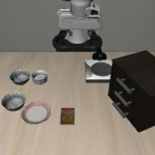
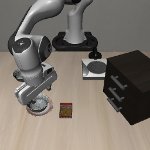

# Phase 1：Spatial 同场景双向选碗核查

日期：2026-10-08（Asia/Shanghai）。状态：init0 两次已完成，00:10 正常退出（退出码 0）。盘子旁碗条件成功，ramekin 旁碗条件 neither；未通过双向核查，按规则不扩 init1、init2。

此前 Goal 场景的原生盘子／炉子指令和事实追加在 VLA-Adapter 上成功，但两条远近指代及短版均失败。本轮改用已配置的 Spatial 权重，在同一个物理 task 8 中通过 `next to` 选择不同的黑碗，目的地始终为盘子。

## 冻结的指令与目标

| 条件 | 完整指令 | 预期操作对象 |
| --- | --- | --- |
| plate_side | `pick up the black bowl next to the plate and place it on the plate` | akita_black_bowl_1 |
| ramekin_side | `pick up the black bowl next to the ramekin and place it on the plate` | akita_black_bowl_2 |

两条件共用 task 8 的物理场景与初始化文件。第二条文字来自官方 Spatial task 1，但本轮不使用 task 1 的场景或初始化。task 8 资产定义中碗1在 `main_table_next_to_plate_region`、碗2在 `main_table_next_to_ramekin_region`；实际运行还需逐次检查两碗到各参照物的距离，要求预期碗较另一碗至少近 0.05 米，并核查原生及策略预处理后的双相机画面。

## 配置与推进规则

VLA-Adapter 原版权重 `VLA-Adapter/LIBERO-Spatial`，固定 revision `45caa9bca50d3ea6f8e804fe04c65abac1b69717`。沿用原版 LIBERO、`use_pro_version=False`、双相机 256×256、原生预处理、本体状态、每次执行 8 个动作、20 Hz、环境与策略 seed=1。重置后先静置 10 步，再观察最多 300 个策略步；原官方 Spatial 基线为 220 步，本轮延长观察以统一两个选碗条件，不与原官方基线作完全相同协议的成功率比较。

先执行 init0 两条 N-only 指令；只有两条正确对象独占完成时才补 init1、init2，共最多六次。每方向至少 2/3 正确对象完成只作为探索推进条件，不作稳定成功率证明。此次不加入辅助事实或冲突，不恢复此前停止的 SmolVLA 试验。

评估器共用两个碗上盘子的 AND 判据，该元数据不作为策略输入；全过程分别记录两个对象的独立放置事件，分类为 `bowl1_only`、`bowl2_only`、`both`、`neither`。正确碗独占完成才算本条件成功，单个放置事件不提前结束观察。记录首次指垫双侧接触、物体抬升、位移及逐步轨迹；robosuite `_check_grasp` 接触判据只作抓取代理，不单独证明稳定抓持。

## 运行与产物

[运行脚本](../scripts/check_phase1_spatial_reference.py) 导入先前运行器的模型查询和实际 tokenizer 核查逻辑，不修改冻结的旧脚本。两次重复重置首动作块额外计为诊断查询；同一初始化两条件须具有相同初始观察、模拟器状态及初始化 SHA-256。每次策略查询分别检查双相机实际对话 prompt 和 token，无截断。

完整输出 `outputs/phase1/vla-adapter-spatial-reference-N-20261008/`，日志 `logs/phase1-adapter-spatial-reference-N-20261008.log`，均由 `.gitignore` 排除。已保存可提交的 [汇总](assets/phase1/spatial-source-summary-20261008.json)、[配置](assets/phase1/spatial-source-manifest-20261008.json)、[重置核查](assets/phase1/spatial-source-reset-audit-20261008.json)和 [实际输入核查](assets/phase1/spatial-source-input-audit-20261008.json)。发生异常或中止时，运行器保留当前条件、查询成本和部分轨迹；本轮没有中止或异常。

## 日志摘要

原始日志：`logs/phase1-adapter-spatial-reference-N-20261008.log`。启动阶段记录了 Spatial 策略加载、配置备份、动作块长度 8、动作维数 7、本体状态维数 8；加载的模型类为 `OpenVLAForActionPrediction`。

原始日志大小 6,296 字节，SHA-256：`b08914eed225283680fe9ee44b287940033150d4b17d7aa50e5c991210f2d406`。

| 日志关键事件 | 摘要 |
| --- | --- |
| `SPATIAL RESET AUDIT` | `passed=True action_diff=0.0`，重置一致性核查通过 |
| `SPATIAL START ... plate_side-N` | 固定 task 8、init0，要求选择盘子旁的碗1 |
| `SPATIAL RESULT ... plate_side` | `bowl1_only`，第 99 步完成；300 步、38 次策略调用 |
| `SPATIAL START ... ramekin_side-N` | 相同初始状态，要求选择 ramekin 旁的碗2 |
| `SPATIAL RESULT ... ramekin_side` | `neither`，目标碗2没有双侧指垫接触；非目标碗1位移约 14.5 厘米 |
| `SPATIAL SUMMARY` | `status=completed`、`episodes=2`、`expanded=false`、`N_screen_passed=false`；76 次 rollout 查询及 2 次诊断查询 |
| 启动器退出状态 | 退出码 0；没有 episode 异常或中止，按预定推进规则结束 |

初始化日志包含 robosuite 私有 macro 未配置、Gym 维护状态提示及 TensorFlow CUDA 工厂重复注册消息。这些消息出现在模型加载之前；本轮随后完成了模型加载、重置核查及两次完整 rollout。因此本轮 `ramekin_side` 记录为有效行为失败，未归类为加载或接口异常。单个初始化不足以确定其具体原因。

日志摘要、结构化结果、运行脚本和三张诊断截图一并归档。完整原始日志、逐步轨迹和视频保留在本地运行目录，相关目录遵循现有 `.gitignore`。

## 结果与解释

| init0 条件 | 预期对象 | 放置分类 | 首次正确放置 | 指垫双侧接触 |
| --- | --- | --- | --- | --- |
| plate_side | 碗1 | bowl1_only，成功 | 第 99 步 | 碗1第 69 步首次，33 个采样状态；碗2无 |
| ramekin_side | 碗2 | neither，失败 | 无 | 碗2无；碗1第 127 步首次，仅 2 个采样状态 |

两次均观察满 300 策略步，各 38 次策略查询，合计 76 次；重置诊断另 2 次，新增总查询 78 次。盘子旁条件第 300 步仍只有碗1满足放置；ramekin 旁条件全程两个碗都没有完成放置。init1、init2 没有执行，不能将单次计数写成 1/3、0/3，也没有检验完整三初始化筛查门槛。

盘子旁条件中，碗1最大抬升约 11.2 厘米、位移约 16.2 厘米，碗2无明显位移。ramekin 旁条件中，目标碗2没有双侧指垫接触，最大位移约 2.8×10⁻⁷ 米；碗1发生过双侧接触、最大位移约 14.5 厘米、最大抬升不足 1 厘米。这支持模型在该失败轨迹中操作了非目标碗1附近的区域；短暂接触不证明稳定抓错碗，单个初始化也不能建立一般对象偏好。

配对核查通过：两次 rollout 与重置诊断的初始观察、模拟器状态、初始化摘要一致；重复首动作块最大差异为 0。init0 的碗1到盘子／ramekin 的平面距离约 0.119／0.221 米，碗2约 0.263／0.102 米，两个指代均满足预设至少 0.05 米差值。原生与裁剪后的主相机可辨认两个黑碗、盘子和 ramekin；腕部相机视野较窄，保存供复核，不单独要求两碗同时可见。

实际对话包装后 plate_side 为 52 token、ramekin_side 为 54 token；两条件各核对了 76 份双相机 processor 输入，解码与完整上游 prompt 一致，无截断。此处两个 Q 的对象指令不同，不是等长固定指令下的事实干预，不能据此计算图文主导。

结论：原生 task 8 条件在同 init0 上成功，但同场景改指令选择另一只碗没有通过。先前官方 task 1 在自身场景成功，不能替代本轮在 task 8 中选择碗2的验证。因此 Spatial 的训练内措辞仍未在当前场景建立双向目标绑定，不扩样、不进入辅助事实或冲突。失败原因可能涉及指代、场景与训练分布等因素，尚未隔离。

