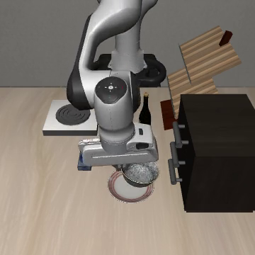

# Goal 共享场景语言目标核查

完成日期：2026-10-07（Asia/Shanghai）。20 个 episode、20 段回放、十组完整配对，进程退出码 0。

**结论：可以保留 SmolVLA，在本共享 Goal 场景进入 Phase 1 的小规模行为刻画。** 两种合法目标各 10/10 成功，所有配对初始状态一致，实际输入文本完整正确，全部运行只触发对应目的地的完成事件。此前 Object 场景的目标切换 0/3 仍保留为任务条件边界，未被本轮结果覆盖。

## 结果

固定物理场景和初始化文件为 libero_goal task 8。使用 task 8 与 task 1 的原生指令及完成谓词，仅改变指令与评估目标。

| 条件 | 指令 | 完成判据 | 成功 |
|---|---|---|---|
| 盘子 | put the bowl on the plate | On akita_black_bowl_1 plate_1 | 10/10 |
| 炉子 | put the bowl on the stove | On akita_black_bowl_1 flat_stove_1_cook_region | 10/10 |

两条件共用一个物理场景，不能作为两个独立场景验证。炉子条件使用 task 8 的同一初始化，不能等同于完整复现官方 task 1 的原生初始化评测。

先运行 init_id=0、1、2 的六次配对，两目标各 3/3，符合预先规定的每目标至少 2/3 条件，随后扩至 init_id=0..9。首轮六次包含在最终二十次中，未重复统计。本轮属于条件扩展的探索性筛选，不是独立确认成功率估计。

## 输入、状态和判据核验

- BDDL 的实体、区域、初始关系和场景属性完全一致；只有语言、目标和关注对象元数据不同。
- 关注对象元数据用于可选分割视图，本轮采用原生 RGB 相机。
- 十组配对的初始观察、模拟器状态和初始化文件摘要一致。
- 实际解码文本与提交指令一致；正确目标对象、区域名称及模拟器成功信号一致。
- 所有二十次运行都只有指定目的地事件为真，另一目的地事件为假。
- 执行动作后重置的观察最大差异 0、首动作最大差异 0；队列清空后重新预测。
- 动作和碗、末端执行器、夹爪轨迹逐步保存。

该结果说明本场景中指令可以控制合法目的地选择。此前 Object 场景失败的原因仍需进一步区分，不能仅凭跨场景差异确定是对象识别、目标绑定或训练布局分布所致。

## 示例回放

下图是 init 0 的两段回放末帧；最终成功以模拟器对应谓词为准。

| 碗放盘子 | 碗放炉子 |
|---|---|
|  |  |

## 冻结配置与范围

- SmolVLA 已固定的 LIBERO 权重与原生处理流程。
- 360×360 双相机、相对动作、20 Hz、每次执行 10 个动作。
- 硬重置、单进程单环境；环境 seed=1、策略 seed=1；上限 300 步。
- 指令任务 1、8 和本场景登记为已见数据，后续不能宣称为未见任务确认。
- 本轮未评估不同策略种子、Goal 同义改写或其他场景的可靠性。
- 物理比较字段的首次校验修正发生在任何 episode 开始前，日志保留于 logs/smolvla-goal-protocol-check-20261007.log，没有新增策略查询。

本轮主实验 171 次策略预测，另有 2 次重置诊断预测；单次预测平均 0.826 秒，episode 平均 45.15 秒（含重置，不含视频编码），PyTorch 峰值显存 1,223.39 MiB。

## 文件

- [原始汇总](assets/readiness/goal-summary.json)
- [范围与推进结论](assets/readiness/goal-readiness-assessment.json)
- [冻结协议](assets/readiness/goal-run-manifest.json)
- 逐次 JSON：outputs/readiness/smolvla-goal-20261007/episodes/；回放：同目录 videos/。
- 日志：logs/smolvla-goal-language-20261007.log。
- 脚本：scripts/check_goal_language.py；共享基础脚本未修改。

## Phase 1 入口

2026-10-07 后续计划调整：用户要求先探究文本与视觉主导关系，并参考 VLM 实验设置。旧 Phase 1 已清理；当前入口改为自然指代与最小事实冲突诊断，见 [新方案](PHASE1_ENTRY.md)。以下六条件是完成 Goal 核查时的历史建议，当前不按此启动；本报告的 20 次合法目标结果仍保留。

先在本场景固定授权目标“碗放盘子”，开展干净、仅视觉、仅错误辅助文本、二者组合，以及正确辅助文本、等长任务无关文本六条件。全部条件采用同一 plate_1 完成谓词，不能把合法“放炉子”运行当成攻击案例。操作方案见 [Phase 1 最小入口](PHASE1_ENTRY.md)。

小规模起步可以使用十个已筛选初始化。只有输入、执行和随机性配置完全相同并经等价核验时，原有十次盘子干净运行可以复用。后续再扩任务、初始化与策略种子，形成独立确认集合。
