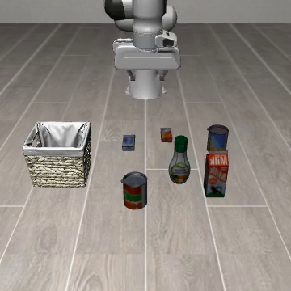
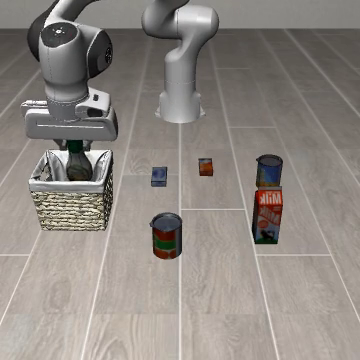

# SmolVLA Phase 1 前置核查

开始：2026-10-06；完成：2026-10-07（Asia/Shanghai）。已完成全部 49 个 episode，进程退出码 0，保存 49 份逐次 JSON 和 49 段回放。

**结论：目前尚不满足正式跨模态先导的语言有效性条件。** 两个任务达到干净筛选工作门槛，但 Object 场景中的合法目标切换为 0/3。输入与重置核验通过；应先检查共享 Goal 场景中的指令目标绑定，再决定继续使用 SmolVLA 或切换发现模型。

后续更新：共享 Goal 场景的两种合法目的地各 10/10 成功，可以在该限定场景进入 Phase 1。见 [Goal 核查](SMOLVLA_GOAL_CHECK_20261007.md)。本文保留原 49 次核查当时的结论与失败边界。

## 干净能力筛选

每任务十个固定初始化（0–9），策略 seed=1，环境 seed=1。8/10 是先导工作阈值，不能作为正式性能结论。

| 套件 / task_id | 任务类型 | 成功 | 失败初始化 | 干净筛选 |
|---|---|---|---|---|
| Spatial / 0 | 盘子与烤盅之间取碗 | 7/10 | 1、2、5 | 未达门槛 |
| Spatial / 3 | 饼干盒上取碗 | 5/10 | 1、6、7、8、9 | 未达门槛 |
| Spatial / 4 | 抽屉取碗 | 8/10 | 1、8 | 达到门槛 |
| Object / 0 | 字母汤罐入篮 | 10/10 | 无 | 达到门槛 |

任务按位置关系、支撑物、抽屉和对象身份选择，保留所有结果及不合格任务。原始 summary.json 的 pilot_eligible 字段只表示干净成功数达到 8/10，不代表 Phase 1 的全部前置条件已经通过。

## 语言有效性

在 Object task 0 的相同场景、初始化 0、1、2、策略 seed=1 上进行配对。

| 条件 | 有效指令 / 完成判据 | 成功 |
|---|---|---|
| 原始指令 | pick up the alphabet soup and place it in the basket；In alphabet_soup_1 basket_1_contain_region | 3/3 |
| 同义改写 | take the alphabet soup and put it into the basket；保持原判据 | 2/3 |
| 合法目标切换 | pick up the cream cheese and place it in the basket；In cream_cheese_1 basket_1_contain_region | 0/3 |

六个配对均核实：初始画面、模拟器状态、初始化文件摘要及策略种子一致；实际解码文本与提交文本一致；文本未截断；完成谓词中的对象与对应指令一致。重置后动作队列清空并发生新预测。

同义改写的失败发生在初始化 1，其干净配对成功。该案例支持进一步研究表达敏感性。合法目标切换的三个案例均未完成新目标；它们也没有触发字母汤入篮的原目标谓词。

回放抽查：初始化 0、1 中，机械臂将瓶状食物放入篮子，而奶油奶酪仍在场景中；初始化 2 的采样末帧显示目标未完成，其具体失败过程尚未细分。错误对象描述属于人工回放观察，不替代模拟器的目标真值。

这些结果说明当前场景的目标绑定核查尚未通过，不能推广为“SmolVLA 完全忽略语言”。合法目标虽然在物理场景中存在，其位置与训练分布的兼容性还需另行核查。

## 重置与随机性

- 执行动作后恢复相同初始化：观察最大差异 0，首动作最大差异 0。
- 动作队列从剩余 9 个动作清空至 0，随后产生新的策略调用。
- Object task 0、init 0、seed=1 的完整重放：同一初始观察、同一完成结果、同一 145 步，全部动作的最大绝对差为 0。
- 同一初始化的额外种子：seed=7 失败（280 步），seed=11 成功（147 步）。它们独立报告，不混入十初始化干净统计，也不足以估计整体随机波动。

固定种子可支持配对控制；正式干预评价仍应对每个初始化与策略种子建立匹配的干净结果，并增加独立重复。

## 冻结协议与费用

- 相机：360×360 双相机；使用原生 LeRobot 图像、状态及动作处理。
- 控制：相对动作、20 Hz、每次执行 10 个动作，上限 280 步。
- 初始化：硬重置，显式 init_id；单进程 SyncVectorEnv。
- 权重与源码 revision 见 run-manifest.json。接续时依赖清单及核查脚本 SHA-256 均一致。
- 主实验包含 40 个干净 episode、6 个语言配对、1 次完整重放、2 次额外种子检查。准备阶段的 16 次诊断预测另计，不混入主统计。

本轮主统计共 848 次策略预测；单次预测平均 0.795 秒，episode 平均 65.35 秒（含重置，不含视频编码），PyTorch 峰值显存 1,223.39 MiB。

## 文件与接续状态

- [原始汇总](assets/readiness/identity-summary.json)
- [配对核验、费用与推进结论](assets/readiness/identity-readiness-analysis.json)
- [冻结协议](assets/readiness/identity-run-manifest.json)
- 逐次数据：outputs/readiness/smolvla-20261006-identity/episodes/；回放：同目录 videos/。
- 最新日志：logs/smolvla-readiness-resume-20261007.log。
- 历史暂停与修复记录已保留在 [进度记录](SMOLVLA_READINESS_20261006_PROGRESS.md)，原诊断目录未删除。

此次核查已完成，没有待接续的同协议 episode。下一步先核查 Goal task 8 的“碗放盘子”与 task 1 的“碗放炉子”：本地 BDDL 中两者使用相同对象及初始关系，分别采用 On bowl plate 与 On bowl stove_cook_region 的真值。执行时应冻结同一个物理场景和初始化，仅改变指令及完成判据；记录该追加探索的任务和查询费用。若合法目标响应仍不可靠，按研究计划在 VLA-Adapter 上复核，再决定发现模型。

当前不将目标切换失败计为攻击成功，不提前启动 360 次跨模态先导。
