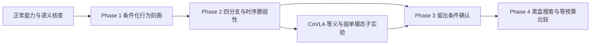

# VLA 黑盒跨模态鲁棒性与攻击研究

**研究方案详细介绍**

**研究定位：** 推理阶段鲁棒性评估 · 条件化行为刻画 · 有限查询黑盒搜索 · LIBERO 仿真验证

**核心问题：** 能否通过可见行为识别跨模态脆弱性，并据此提高黑盒攻击的查询效率？

版本日期：2026-10-09（Asia/Shanghai）。文档性质：研究设计与实施方案；已有结果单独注明来源。

本文采用 CoVLA 研究设计稿的组织形式，将背景、问题、权限、形式化、方法、实验、风险和里程碑集中呈现。研究沿用“行为刻画 → 脆弱性发现 → 适用范围验证 → 基于证据设计攻击”四阶段。CoVLA 的“等义改写、可见补丁、弱单模态约束”是 Phase 2 的协同子问题，不将其假设当作整个项目必须获得的结论。

[项目主页](../README.md) · [专题索引](README.md) · [当前接续](../docs/RESUME.md) · [Phase 1 执行协议](../docs/PHASE1_ENTRY.md)

## 摘要

视觉语言动作模型通过图像、自然语言和机器人状态生成动作。单独检查视觉或语言的鲁棒性，可能遗漏两者相互影响及其在闭环执行中的持续后果；但联合输入导致更高失败率，也可能来自强单模态效应、任务变化或正常能力不足。

本研究面向固定权重的 VLA，在动作输出和任务成功失败可见的黑盒设置中，先验证自然指代与辅助事实的正常能力，刻画冲突信息下的目标选择，再使用同状态四分支测量组合放大、抑制及干扰撤除后的恢复。对于 CoVLA 子实验，进一步要求文本任务等义、补丁可见且任务可执行，检验“单模态弱、联合强”是否在独立样本上成立。

方法采用受约束候选、匹配状态动作筛选和闭环任务反馈校正，在固定总查询预算下比较随机、单模态、独立组合及联合搜索。贡献是否成立取决于独立复现、真实任务后果和等预算方法收益。零交互、负交互、载体不可用或仅局部成立均需保留。

### 研究要点速览

| 要素 | 本项目设定 |
| --- | --- |
| 研究对象 | LIBERO 操作任务中的预训练 VLA，初期以 SmolVLA 为主模型 |
| 访问权限 | 图像、字符串、动作／动作块、任务成功失败；不使用梯度、概率或隐藏表征搜索 |
| 总体路线 | Phase 1 行为刻画 → Phase 2 脆弱性 → Phase 3 范围确认 → Phase 4 方法 |
| 主要假设 | 模态依赖具有条件性；部分组合可能放大或抑制；时序与行为反馈可能有助搜索 |
| CoVLA 子问题 | 等义改写与可见补丁在弱单模态约束下是否产生正交互 |
| 主要证据 | 正常能力、完整配对、独立测试、任务后果、查询预算曲线及负面结果 |
| 当前位置 | Phase 1 正常能力核查；正确辅助事实条件未通过，冲突与协同实验未启动 |

## 1. 研究背景与必要性

### 1.1 从多模态理解到闭环执行

语言给出对象、关系和操作目标，视觉提供当前布局与可操作性。动作改变后续观察，因此输入变化可能影响选物、接近、抓取、放置及恢复；瞬时动作差异与完整任务失败需要分别评价。

### 1.2 正常能力是鲁棒性解释的前提

指代无效、辅助事实不可理解或目标本身不可执行，都可能导致失败。先验证输入语义、对象真值和正常行为，才能解释冲突下的目标选择。正确对象被抓取但放置失败，也不能简单归为语言不理解。

### 1.3 联合更强与协同不同

两模态同时变化可能产生加性效应、抑制或非加性放大。必须保留四分支原始结果，用同一事件和尺度计算交互；搜索得到的联合最优样本不能单独证明自然分布中的协同。

## 2. 相关研究与创新边界

项目已有六篇 VLM／VLA 论文的逐项核对，另有 ICBench／IGAR 的定位说明，完整引用及原文页码见[文献依据](黑盒跨模态攻击/01_研究定位与文献依据.md)。CoVLA 提供设计结构和约束思路，不是实验基线或已有发现。

| 研究线索 | 可借鉴内容 | 本项目需要补足的证据 |
| --- | --- | --- |
| Mixed Signals 与文本误导研究 | 一致输入能力、最小冲突、双向与等长对照 | 机器人目标真值、可执行性、独立事件及闭环后果 |
| MMAS | 联合与独立优化对照 | 普通图像／字符串接口可实现性、完整成本及概率尺度交互 |
| VLA-Fool | VLA 文本、视觉和跨模态攻击评估 | 可见反馈优化、配对自然失败控制和等预算收益 |
| 冲突探针与 ICBench／IGAR | 冲突信号、语言接地和行为的区分 | 与已有覆盖区分的黑盒搜索贡献 |
| CoVLA 设计稿 | 等义保持、可见补丁、弱单模态与严格交互 | 独立现象、约束满足率及受约束搜索收益 |

“首次多模态攻击”“首次黑盒攻击”或“联合组比单侧组更差”不能直接作为贡献。拟验证的增量是行为规律是否提高有限查询搜索效率，组合收益能否排除主效应与语义变化，以及冻结候选的迁移和时序边界是否可复现。

## 3. 科学问题、假设与交付目标

| 编号 | 研究问题 | 阶段与判定依据 |
| --- | --- | --- |
| RQ1 | 模态影响如何随任务、可靠性和阶段变化？ | Phase 1：正常能力、双向冲突、全样本选择与不可判定比例 |
| RQ2 | 动作与任务结果怎样提供有效搜索反馈？ | Phase 2／4：动作代理与任务后果对应、反馈消融及成本 |
| RQ3 | 两模态是否产生可重复的放大或抑制？ | Phase 2：四分支 Γ；CoVLA 另加等义与弱单模态约束 |
| RQ4 | 干扰进入与撤除时刻怎样影响执行和恢复？ | Phase 2／3：时序分支，区分接触前偏移与物理后果 |
| RQ5 | 行为规律能否提高效率，冻结候选能否迁移？ | Phase 3／4：留出确认、等预算方法比较与冻结候选评价 |

交付包括有效样本与语义清单、行为图谱、四分支及恢复数据、黑盒搜索原型、查询账本、独立确认及失败案例。协同是 RQ3 的条件性假设；一般黑盒方法可以依据稳定的条件依赖或时序风险成立。具体假设与反证见[研究定位](黑盒跨模态攻击/01_研究定位与文献依据.md)。

## 4. Threat Model：系统、输入与权限边界

### 4.1 被测系统

一次调用表示为 `π(I_t, T_goal, C_t, q_t, h_t)`。图像、授权目标、辅助文本、本体状态和历史仅是研究变量的划分，不要求模型具备独立通道。权重、预处理、动作转换、控制频率及判据固定，保留原生相机与本体接口。

### 4.2 两类语言设定

事实冲突实验保留授权目标，改变同一时刻、同一事实的辅助描述；CoVLA 将指令 T 改写为等义 T′，保持动作、实体、关系、数量、顺序及限制。合法目标切换与不可执行指令另设类别。辅助信息通常拼接至原任务字符串，不能虚构输入通道。

### 4.3 视觉与物理约束

视觉干预保持目标身份、可见性、布局和可执行性。CoVLA 优先使用非关键表面的可见贴片，记录面积、位置、视角和暴露规则。数字叠加、仿真表面锚定与真实相机贴片分别报告；数字结果不自动支持物理可行性。

### 4.4 攻击端与评估端

攻击端使用图像、字符串、动作及任务成功失败。对象位姿、接触、风险标签和完整模拟器状态属于评估端，不能自动成为搜索反馈。可重置离线搜索与不可重置在线设置另行声明；评估端配对随机性不代表攻击者具有控制随机性的能力。

同时编辑图像和任务字符串需要明确的双通道能力。如果部署仅允许环境变化而保护用户指令，联合实验应表述为双输入鲁棒性评估。详细分类见[黑盒设定](黑盒跨模态攻击/02_黑盒设定与任务定义.md)。

## 5. 形式化：诊断、交互与协同判据

### 5.1 Phase 1 事实冲突诊断

N 为无辅助，A 为正确事实，X 为最小错误事实，U 为等长无关事实。对两个互补指代 Q 分别构造与视觉一致／冲突的事实，平衡固定选物偏好。全部有效 X rollout 为分母：

```text
F_V = 仅完成视觉所指目标的次数 / 有效 X rollout 数
F_T = 仅完成文本所指目标的次数 / 有效 X rollout 数
D = F_T - F_V
```

两个 Q 分别报告再等权汇总，both 与 neither 保留。D 是条件化行为倾向，不是内部模态权重；N/A/X/U 不等价于视觉×语言扰动的二因素四分支。

### 5.2 Phase 2 同状态四分支

| 分支 | 视觉输入 | 文本输入 |
| --- | --- | --- |
| 00 | 原始观察 | 原始有效指令 |
| 10 | 固定视觉变化规则 | 原始有效指令 |
| 01 | 原始观察 | 固定语言变化规则 |
| 11 | 与 10 相同的视觉规则 | 与 01 相同的语言规则 |

错误辅助信息家族记为 C00/C10/C01/C11；CoVLA 等义家族记为 E00/E10/E01/E11。各家族内部共享目标 G、初始状态、事件和尺度，分别统计。令 pij 为同一种失败事件的概率：

```text
ΔV  = p10 - p00
ΔT  = p01 - p00
ΔVT = p11 - p00
Γ   = p11 - p10 - p01 + p00 = ΔVT - ΔV - ΔT
```

Γ 与 CoVLA 稿中的 Δint 是同一种加性尺度差中差。正值表示该尺度上的放大，负值表示抑制；概率上限、自然失败和状态选择影响解释。短视窗动作与闭环终点分别报告。

### 5.3 Weak Alone, Strong Together

CoVLA 的先导工作标准为 `|ΔV| ≤ 0.10、|ΔT| ≤ 0.10、ΔVT ≥ 0.20、Γ ≥ 0.10`，数值均为绝对概率差。它们是探索阈值；确认前结合先导方差和最小关注效应冻结。绝对主效应避免把单侧大幅改善误称为“弱”。

等义通过、补丁合法、主效应弱与联合效应强需共同满足。报告原始四项概率、区间、覆盖率和约束满足率，不能用测试集回调阈值或只展示显著样本。

## 6. 方法设计：从正常能力到黑盒搜索



### 6.1 模块一：样本与状态管理

保存任务、场景、初始化、指令、独立对象事件、完整状态和版本。状态分支恢复模拟器、策略缓存、动作队列及随机状态。阶段由事件定义，同轨迹状态不当作独立 episode。

### 6.2 模块二：受约束候选

事实模板先检查真值、唯一替代目标、拼接和有效 token；等义候选另保存语义元组、独立复核与拒绝原因。视觉候选检查区域、强度、目标可见性和可执行性，先固定一种载体再扩展。

### 6.3 模块三：四分支与闭环校正

先用同状态、同动作时段的归一化动作变化降低筛选成本，再完整执行以任务成功失败校正。动作变化大但任务成功不计攻击成功；保留四项结果，单次失败不自动代表概率效应。

### 6.4 模块四：有限预算搜索

构造低维视觉参数与离散文本库，比较随机、单侧、独立组合和联合搜索。CoVLA 条件扩展先过滤语义、补丁及弱单模态约束，再依据 Γ 和联合失败增量排序；主方法不访问隐藏表征。最终评价使用冻结候选及独立数据。

### 6.5 模块五：诊断与机制解释

优先使用文本替换、贴片外观／位置替换和干扰撤除等行为干预。表征探针、注意力与 activation patching 为独立的可选白盒诊断，不向攻击端提供候选；注意力变化本身不证明机制。

流程详见[行为与脆弱性](黑盒跨模态攻击/04_行为刻画与脆弱性发现.md)及[搜索方法](黑盒跨模态攻击/05_黑盒搜索与攻击方法.md)。

## 7. 实施路线与里程碑

| 阶段 | 必要工作 | 交付与继续条件 |
| --- | --- | --- |
| Phase 1 行为刻画 | 正常能力、事实真值、N/A/X/U 双向诊断及独立复现 | 对照可用、倾向与不可判定边界清楚；当前仍在正常核查 |
| Phase 2 脆弱性发现 | 固定目标四分支、CoVLA 等义协同、进入／撤除时序 | 可重复交互、条件依赖或恢复边界；不要求所有任务正交互 |
| Phase 3 范围验证 | 留出初始化、模板、任务及合格模型 | 排除明显语义变化、自然失败和预算差异；报告失效范围 |
| Phase 4 方法设计 | 黑盒搜索、反馈消融、等预算比较与最终留出评价 | 方法收益、完整成本及迁移证据；协同搜索以协同证据为前提 |

Phase 3 确认现象范围，Phase 4 对算法另做最终留出评价，数据用途分别登记。本次文档整理不启动新实验或增加预算。

## 8. 实验设计、指标与公平比较

### 8.1 模型与任务

当前主模型为 SmolVLA，VLA-Adapter 原版和 PulseVLA-LIBERO 为验证候选。各模型保留自身正常能力和原生栈，核查通过后加入；SmolVLA 与 PulseVLA 不当作完全独立架构。套件、初始化和样本量依据语义、资产及先导功效决定。

### 8.2 实验矩阵

| 实验 | 主要问题 | 必要对照 |
| --- | --- | --- |
| E1 正常能力与事实冲突 | RQ1 目标选择 | N/A/X/U、互补指代、全样本与正常成功子集 |
| E2 固定目标交互 | RQ3 放大或抑制 | C 家族四分支、中性视觉、无关／正确事实与随机配对 |
| E3 CoVLA 等义协同 | RQ3 受约束正交互 | E 家族四分支、语义复核、弱单模态合规与留出确认 |
| E4 时序与恢复 | RQ4 关键阶段和纠正 | 相同阶段／长度、进入与撤除、接触前后区分 |
| E5 范围验证 | RQ1／3／4 适用性 | 独立初始化／模板／任务／合格模型，负结果同列 |
| E6 搜索与消融 | RQ2／5 效率与迁移 | 随机、单侧、独立组合、联合；动作／任务／两阶段反馈 |

### 8.3 主指标

报告各条件 SR／FR、配对 cASR、指定错误事件、Γ、恢复率及时延。CoVLA 另报告等义通过率、独立复核、补丁合法性、弱单模态合规率及协同比例。搜索命中率与自然测试池出现率分别定义。

### 8.4 统计与预算

以完整 rollout 为观测单位，按任务／初始化配对及聚类，采用分层配对 bootstrap 报告 95% 区间。同 seed 确定性重放用于复现，不增加独立样本量。先导、开发、验证和确认分开，阈值与主要比较预先冻结。

每次策略预测请求记一次查询，取已有动作队列不新增查询。参考、筛选、rollout、重试及复测均记账；搜索和最终评价分别统计，同时报告 GPU／墙钟时间、控制步与暴露长度。不同模型原始成功率和动作 L2 不直接排名。

### 8.5 论文图表安排

- Figure 1：流程与四分支案例。
- Figure 2：全样本行为图谱、主效应和 Γ 分布，包含正／零／负交互。
- Table 1：正常能力、约束合规和四项结果。
- Table 2：等预算搜索与反馈消融。
- Figure 3：阶段、暴露长度和撤除恢复。
- Table 3：留出条件及冻结迁移，注明能力覆盖。

指标、资产和留出规则详见[评估协议](黑盒跨模态攻击/06_评估协议与迁移验证.md)。

## 9. 当前实证进度与下一步

截至已登记的 2026-10-08 结果，SmolVLA 在 Spatial task 8 原双碗、init0..2 的两个方向 N 均 2/3 成功，A 均 0/3。共 12 条 N/A、360 次 rollout 查询及 2 次旧诊断；其中新增 10 条、300 次查询，两条旧 init0 N 只复用一次。真值、画面和等长预检通过，A 行为未通过。

2026-10-09 另完成 init0 两方向的独立中性追加诊断，均 neither，新增 2 条／60 次查询，零新策略诊断调用。原 N/A 只作已见参考，不再计成本；该探针不属于正式 X/U 矩阵，也不能单独隔离长度、换行和参照物提及效应。见[诊断报告](../docs/PHASE1_SMOLVLA_SPATIAL_NEUTRAL_20261009.md)。

正式 X/U 冲突矩阵、80 条扩样及 CoVLA 协同实验未启动。先重新设计辅助事实载体，冻结后核查 A；原版指代、初始化与门槛保持。四个 Q×N/A 块各至少 2/3 正确独占完成才进入条件性 X/U；该门槛用于探索推进，不代表稳定成功率。

Adapter 的 14 条完整诊断、536 次查询及单碗／措辞边界，更早 SmolVLA 结果均保留，不填入当前正常对照或留出数据。更新进度以[接续记录](../docs/RESUME.md)、[最新 N/A 报告](../docs/PHASE1_SMOLVLA_SPATIAL_NA_20261008.md)及[账本](黑盒跨模态攻击/07_实施路线与查询预算.md)为准。

## 10. 风险、判废标准与推进优先级

| 风险 | 对结论的影响 | 继续／收缩规则 |
| --- | --- | --- |
| 正常指代或事实不可用 | 无法解释冲突选择 | 停在能力核查，重审载体，不运行 X/U |
| 等义改写改变实体、关系或步骤 | 任务保持失效 | 拒绝候选并保留审查 |
| 联合失败来自强单侧或概率边界 | 不支持弱单模态协同 | 报告主效应、强度与 Γ，收窄解释 |
| 搜索或阈值使用测试反馈 | 泛化和出现率有偏 | 冻结后独立确认，重新搜索另列 |
| 接触后物理变化被称为记忆 | 时序解释不成立 | 区分接触前偏移与接触后后果 |
| 模型栈或动作尺度不同 | 鲁棒性／架构排名失真 | 模型内配对、任务级指标、限制分表 |
| 权限超过现实接口 | 黑盒／物理主张失真 | 明确双输入、离线／在线及评估权限 |

优先级为正常能力和语义 → 配对现象 → 独立范围证据 → 简单方法 → 更广覆盖及可选机制。协同不复现时保留负面发现，转向证据支持的条件脆弱性或测量研究，不以增加模块维持协同叙事。

## 11. 预期贡献与论文叙事

若实证支持，先说明正常能力与输入约束，再给出条件性行为和闭环后果，用四分支区分主效应与交互，最后证明行为规律如何改善有限预算搜索并呈现迁移边界。CoVLA 只有在等义、弱单模态及独立确认共同满足时，才能形成“单独温和、联合放大”的贡献。

不承诺首次、普遍协同、所有模型迁移或特定会议录用。方案的价值应来自可复核协议、可靠现象、方法收益及清晰边界。

## 参考文献与公开实现

论文作者、出版信息、本地 PDF 及核对见[文献依据](黑盒跨模态攻击/01_研究定位与文献依据.md)和[VLM 原设置参考](黑盒跨模态攻击/08_VLM主导关系实验设置参考.md)。

- [VLA-Fool](https://arxiv.org/abs/2511.16203)：已有多模态攻击的定位参照。
- [ICBench／IGAR](https://arxiv.org/abs/2603.06001v2)：指令冲突及语言接地相关工作。
- [LIBERO](https://github.com/Lifelong-Robot-Learning/LIBERO)、[SmolVLA](https://huggingface.co/HuggingFaceVLA/smolvla_libero)、[VLA-Adapter](https://github.com/OpenHelix-Team/VLA-Adapter)、[PulseVLA-LIBERO](https://huggingface.co/verapulse/pulsevla-libero-0.5b)：运行来源；版本以 [sources.json](../configs/sources.json)、锁文件及每轮 manifest 为准。
- CoVLA（用户提供的 2026-10-08 研究设计稿）：结构及等义协同子实验参考，不是已发表实验结果。
